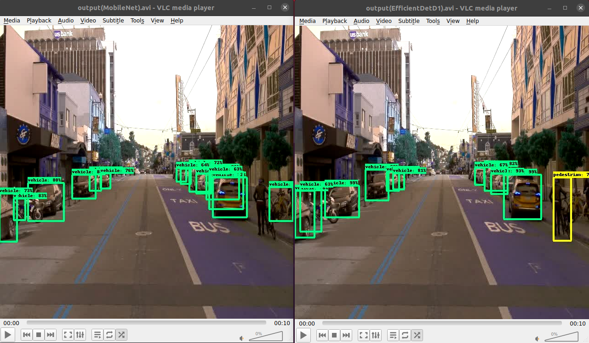
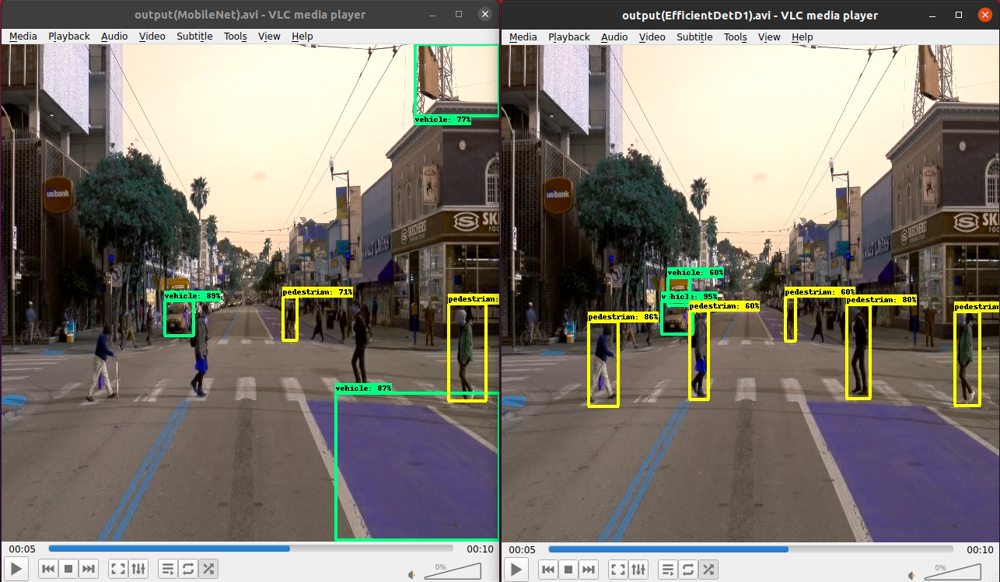
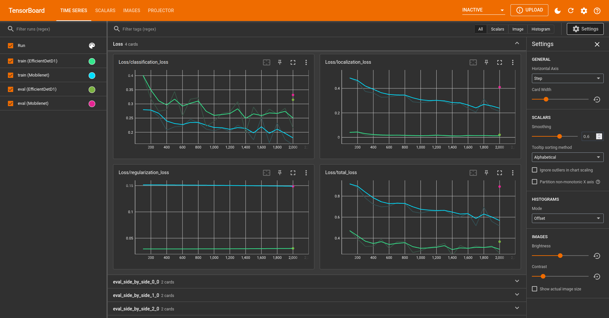
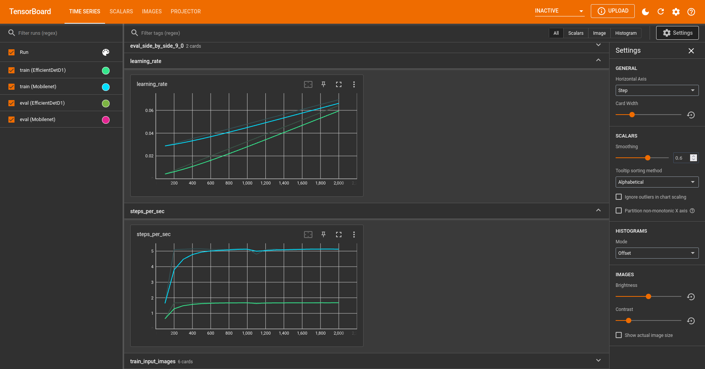
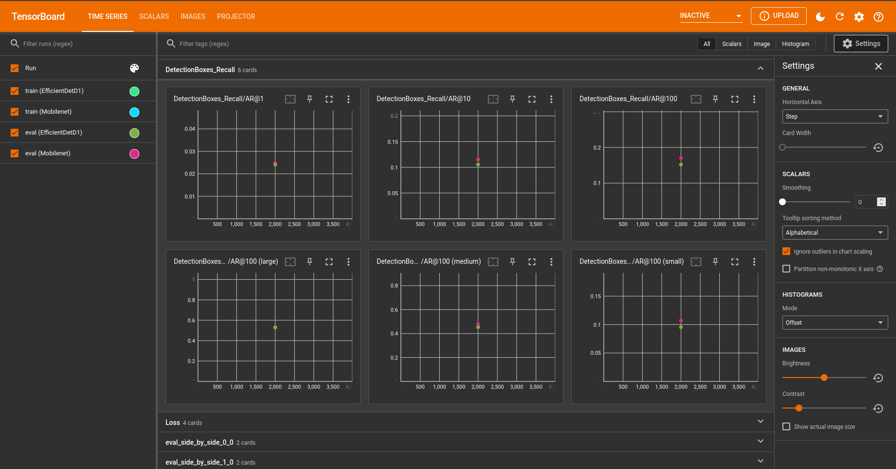
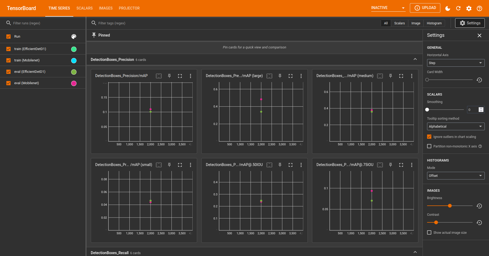

# Object detection in an urban environment

    

# Object detection in an urban environment Project 1:
## Goals
- Get Waymo's dataset
- choose 3 pretrained models to work with
- adjust the configuration of the models
- Train the models
- Test the model and output a video of the detection 

## Pre-trained model from model zoo
I chose 3 models to work with however, I was able to test only 2 as I can no longer access AWS cloud gateway. This is due to the credit limit.

* EfficientDet D1 640x640 (Default)	 
* SSD MobileNet V2 FPNLite 640x640	
* Faster R-CNN ResNet50 V1 640x640	

## EfficientDet D1 vs MobileNet V2

EfficientDet D1 took 36 minutes to finish the training while SSD MobileNet V2 FPNLite took 18 mins only about half the time.

### Comparing the output
As you can see below the MobileNet could not detect the pedestrian while the EfficientDet was able to detect it. Also the confidence level of EfficientDet is much higher than MobileNet.

Here below you can see the false positives for the MobileNet model where the billboard at the top right of the frame and the bus lane both detected as vehicles. Moreover, the MobileNet failed to detect the most important objects in the frame... the pedestrians passing by the street. However the EfficientDet did a much greater job as seen detecting all the nearby pedestrians and no false positves here.

### Tensorboard Graphs
For the loss graph, the MobileNet showed much greater loss than the EfficientDet. 

