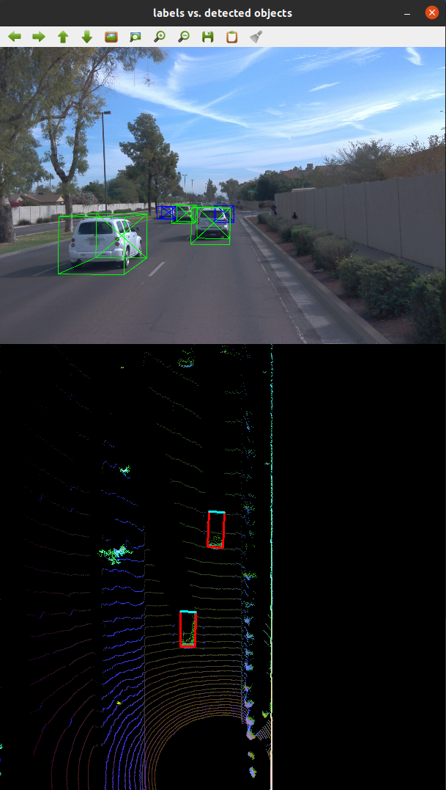
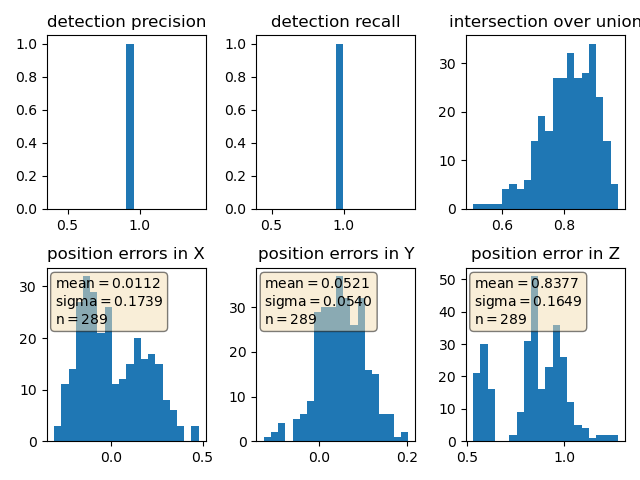

# SDCND : Sensor Fusion and Tracking

## Compute Lidar Point-Cloud from Range Image
### Visualizing range image channels

### Visualizing point-cloud

|             Front            |             Rear            |
|:----------------------------:|:---------------------------:|
|  |  |

## Birds-Eye View from Lidar PCL

### Converting sensor coordinates to bev-map coordinates

### intensity & height layer of bev-map
|             Intensity Map              |            Height Map            |
|:--------------------------------------:|:--------------------------------:|
|  |  |

## Model-based Object Detection in BEV Image

## Performance Evaluation for Object Detection

