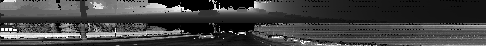
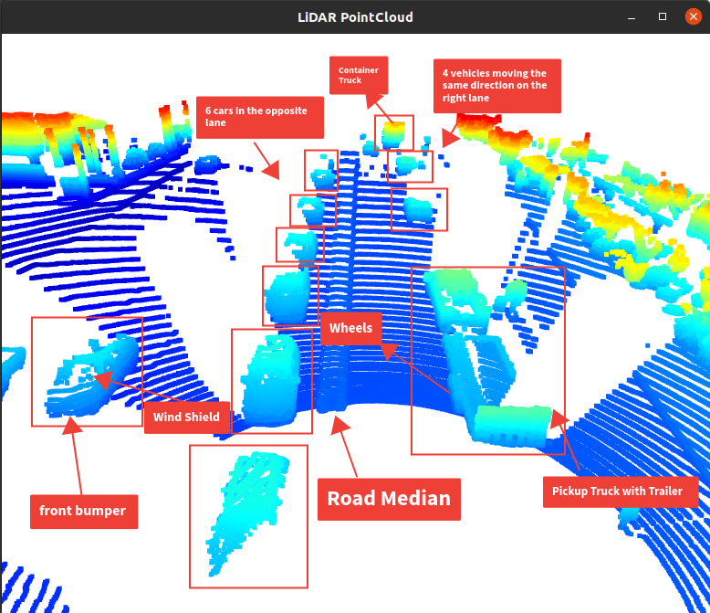
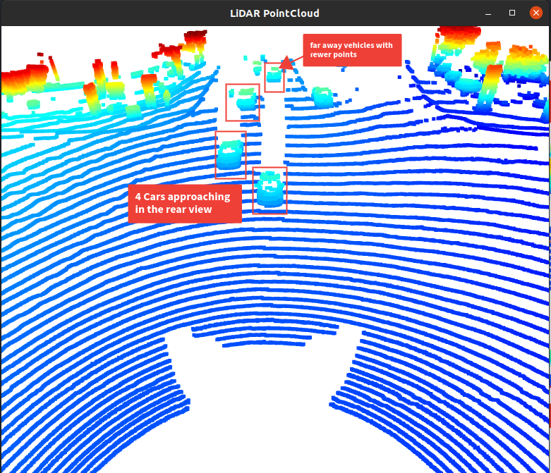
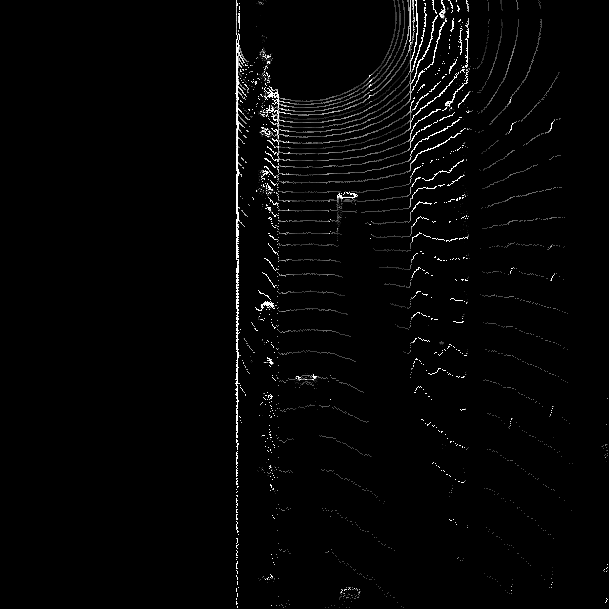
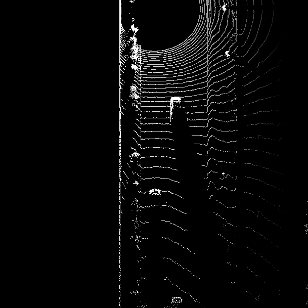
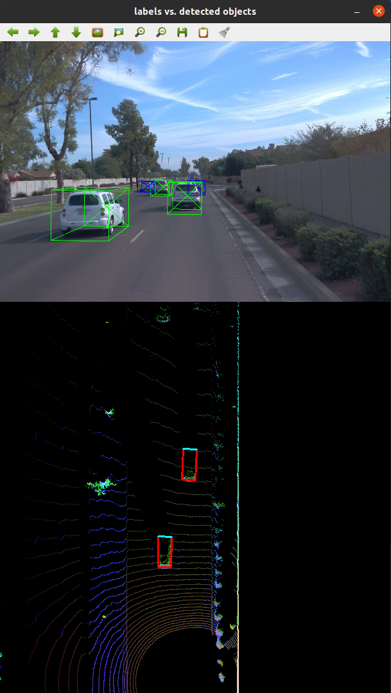
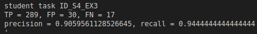

# SDCND : Sensor Fusion and Tracking

## Compute Lidar Point-Cloud from Range Image
### Visualizing range image channels

### Visualizing point-cloud

|             Front            |             Rear            |
|:----------------------------:|:---------------------------:|
|  |  |

## Birds-Eye View from Lidar PCL

### Converting sensor coordinates to bev-map coordinates

### intensity & height layer of bev-map
|             Intensity Map              |            Height Map            |
|:--------------------------------------:|:--------------------------------:|
|  |  |

## Model-based Object Detection in BEV Image

## Performance Evaluation for Object Detection

# Writeup: Track 3D-Objects Over Time

Please use this starter template to answer the following questions:

### 1. Write a short recap of the four tracking steps and what you implemented there (filter, track management, association, camera fusion). Which results did you achieve? Which part of the project was most difficult for you to complete, and why?

### 2. Do you see any benefits in camera-lidar fusion compared to lidar-only tracking (in theory and in your concrete results)? 

### 3. Which challenges will a sensor fusion system face in real-life scenarios? Did you see any of these challenges in the project?

### 4. Can you think of ways to improve your tracking results in the future?

