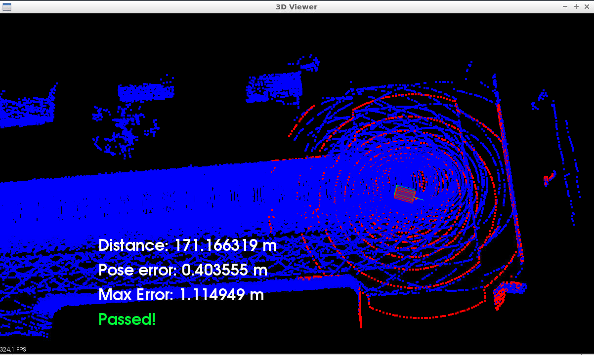

# Scan Matching Localization
localizing a car driving in simulation for at least 170m using carla


## Steps done
Step 1: Filter scan using voxel filter
```cpp
pcl::VoxelGrid<PointT> vg; // creating VG PCL VoxelGrid
vg.setInputCloud(scanCloud); // setting the scanCloud as the input
double filterRes = 0.7; // filter resolution
vg.setLeafSize(filterRes, filterRes, filterRes);
typename pcl::PointCloud<PointT>::Ptr cloudFiltered (new pcl::PointCloud<PointT>);
vg.filter(*cloudFiltered); // output to cloudFiltered

```
Step 2: Find pose transform by using ICP

### ICP Function
```cpp
Eigen::Matrix4d ICP(PointCloudT::Ptr target, PointCloudT::Ptr source, Pose startingPose, int iterations){

	// Defining a rotation matrix and translation vector
  	Eigen::Matrix4d transformation_matrix = Eigen::Matrix4d::Identity ();

  	// align source with starting pose
  	Eigen::Matrix4d initTransform = transform3D(startingPose.rotation.yaw, startingPose.rotation.pitch, startingPose.rotation.roll, startingPose.position.x, startingPose.position.y, startingPose.position.z);
  	PointCloudT::Ptr transformSource (new PointCloudT); 
  	pcl::transformPointCloud (*source,* transformSource, initTransform);


  	pcl::IterativeClosestPoint<PointT, PointT> icp;
  	icp.setMaximumIterations (iterations);
  	icp.setInputSource (transformSource);
  	icp.setInputTarget (target);
	icp.setMaxCorrespondenceDistance (2);
	

  	PointCloudT::Ptr cloud_icp (new PointCloudT);  // ICP output point cloud
  	icp.align (*cloud_icp);

  	if (icp.hasConverged ())
  	{
  		transformation_matrix = icp.getFinalTransformation ().cast<double>();
  		transformation_matrix =  transformation_matrix * initTransform;

  		return transformation_matrix;
  	}
	else
  		cout << "WARNING: ICP did not converge" << endl;
  	return transformation_matrix;

}

```
Step 3: Transform the scan so it aligns with ego's actual pose and render that scan
```cpp
PointCloudT::Ptr correctedscan(new PointCloudT);
pcl::transformPointCloud(*cloudFiltered, *correctedscan, transform);
viewer->removePointCloud("scan");
```

### 170m completed

