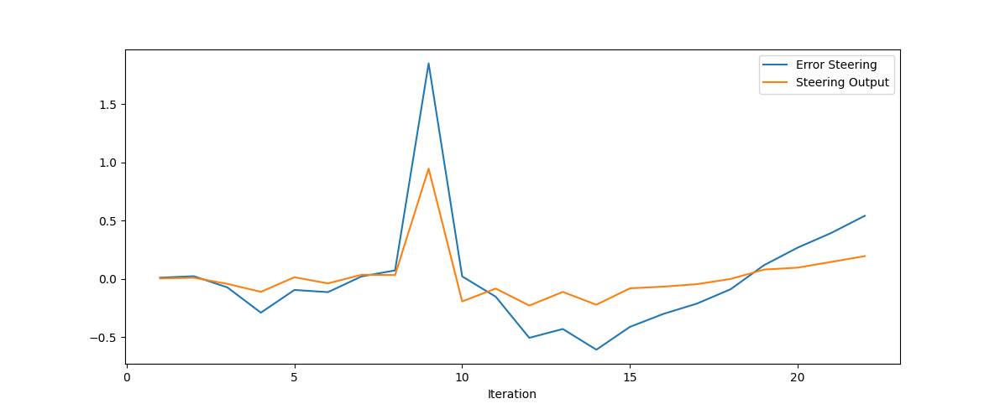
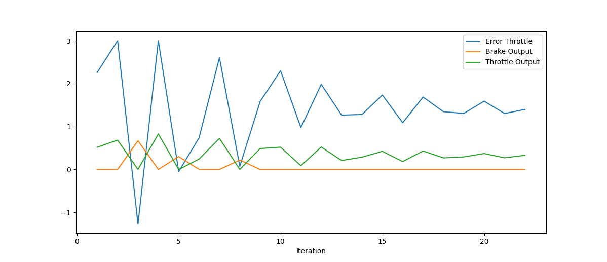

# Control and Trajectory Tracking for Autonomous Vehicle

# Proportional-Integral-Derivative (PID)
following gif speed is x8 the original
 

 **after Review**

 **Comparison between first and second submission**

second trial is on the right side

This video helped me figure out the values of PID
"Controlling Self Driving Cars" 
https://www.youtube.com/watch?v=4Y7zG48uHRo
| Proportional | Integral | Derivative |
| ------------ | -------- | ---------- |
|  |  |  |

### What is the effect of the PID according to the plots, how each part of the PID affects the control command?
- Proportional effect: It is directly proportional to the error, the larger the error, the larger the proportional term, and the larger the control command. This is demonstrated at the peak error in the steering.
- Integral effect: the integral term increases over time as the error persists. 
- Derivative effect: The derivative effect is proportional to the derivative of the error. This means that the derivative term increases as the error changes rapidly. The derivative effect is responsible for reducing overshoot and ringing.
### How would you design a way to automatically tune the PID parameters?
- Ziegler-Nichols method: This is a well-known method for tuning PID controllers.
- Model-based tuning: A mathematical model of the system is used to simulate the system's response to different control inputs.

### PID controller is a model free controller, i.e. it does not use a model of the car. Could you explain the pros and cons of this type of controller?
This PID controller is simple and easy to use however it is too simple for controlling the car correctly as car model is more complex when it comes to the dynamics. A Controller such as MPC would perform much better than PID but it's more complex.
