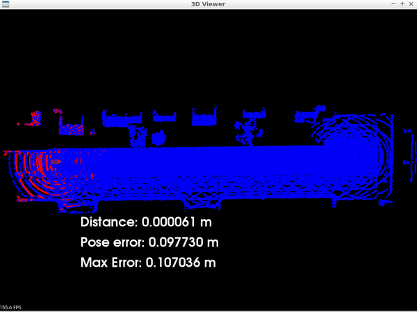

# Self-Driving Car Engineer Nanodegree
## Udacity ND0013 | 2023 Cohort

  

1. [Project 1: Object Detection in Urban Environments (2D)](1-object-detection-in-urban-environment-project)
2. [Project 2: 3D Object Detection with LiDAR Data and Multi-Target Tracking with Extended Kalman filter](2-Sensor-Fusion-and-Tracking)
3. [Project 3: Scan Matching Localization](3-Scan-Matching-Localization)
4. [Project 4: Motion Planning and Decision Making for Autonomous Vehicles](4-Motion-Planning-and-Decision-Making-for-Autonomous-Vehicles)
5. [Project 5: Control and Trajectory Tracking for Autonomous Vehicles](5-Control-and-Trajectory-Tracking-for-Autonomous-Vehicles)

**Computer Vision:**
- Train an object detection model using the Tensorflow Object Detection API and AWS Sagemaker.
- Used a pretrained neural network to detect and classify objects using data from Waymo.
  
 

  

  
**Sensor Fusion:**
- Learn about the lidar sensor and its role in autonomous vehicle sensor suite.
- Detect objects in 3D lidar point cloud using deep-learning approach.
- Fuse camera and lidar detections and track objects over time with Extended Kalman Filter.
  

  

**Localization:**
- Write and optimise scan matching algorithms in C++: Iterative Closest Point (ICP).
- Utilize scan matching algorithms in Point Cloud Library (PCL) to localize a simulated car with lidar sensing.

  

**Planning:**
- Apply model-driven and data-driven approaches to predict how other vehicles on the road will behave.
- Design and implement weighted cost functions and behaviour planning systems in C++.
- Implement the A* and Hybrid A* search algorithms in C++.
- Use numerical approximation and discretisation to solve the Polynomial splines problem.
- Generate a safe trajectory to execute maneuver.

  

**Control:**
- Control a car once you have a desired trajectory.
- Activate the throttle and the steering wheel of the car to move it following a trajectory described by coordinates.
- Implement a simple PID Controller manually tuned.

  

My PID controller after implementing it in Real life 😂

  

